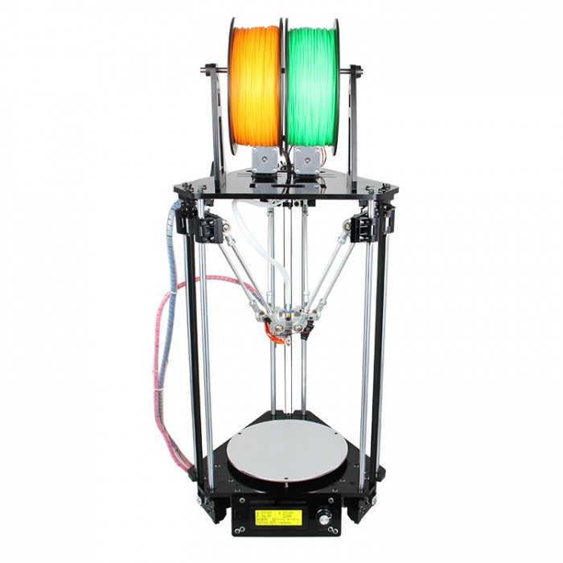

# Marlin 3D Printer Firmware For Delta Geeetech G2S G2S PRO

## Specific version (slightly) modified for easy use on G2 G2S printer
__No guarantee whatsoever – use with caution!__
 
 Compiled and tested on a G2S PRO. Last version of 18  march 2016.

 Main modification :

- modifications on pins_ULTIMAKER.h 

- add Geeetech thermistor table as 14 in thermistortables.h

- Modfication of DEFAULT_STEPPER_DEACTIVE_TIME SD_FINISHED_STEPPERRELEASE SD_FINISHED_RELEASECOMMAND in Configuration_adv.h

- add constants SIN_tower1, SIN_tower2, SIN_tower2, SIN_tower2 in Configuration.h, to change geometry description without modification of the Marlin_main.cpp
  use of theses constants in marlin_main.cpp

- add DELTA_DIAGONAL_ROD_TRIM_TOWER_X in Configuration.h

- modify M401 and M402 in marlin_main.cpp to be blocking for use in gcode scripts (not a bug but usefull)

- modify gcode_G29() in marlin_main.cpp (not a bug) to avoid unpredictable behavior if z_probe is not deployed. (If the probe should not deployed correctly between probes there may be yet some unpredictable behavior)

- modify gcode_T() in marlin_main.cpp to supress a bug in use of G29 AND two extruders

- modify default_version.h to change build name to "1.1.0-RC3 mod G2S"

- modification on DELTA_CALIBRATION_MENU : add submenu for the choice of final height, modify command for low speed on final move

- add of LEDSTRIP support with Fastled library, modification of M150 GCODE, add of a specific LCD menu

- correction of M503 for M665 parameters

- Add three points to delta calibrate menu

- add parameters to G30 :
  + I : number of iteration for repeatability  computations compute mean height and difference sigma 
  + C : print steps on each tower at each z_probe stop
  + Q : divider for the speed of final z_probe approach (from 2 quick, to 50 very slow)

- add the Q parameter to G29 (same function than for G30)

- add I2C and TMP007 support
  + add M125 command to print IR temp
  + add LCD menu to get IR temp

 Further description may be found on the [forum](http://3dprinters.proboards.com/board/3/geeetech-g2-g2s-pro).

 
 Additional documentation on Marlin can be found in [the  wiki](https://github.com/MarlinFirmware/Marlin/wiki/Main-Page).

## Release Candidate -- Marlin 1.1.0-RC3 - 01 December 2015

__Not for production use – use with caution!__

Previously tagged versions of Marlin are not recommended. However, the latest patches to the Marlin 1.0 series can be found in the [1.0.x](https://github.com/MarlinFirmware/Marlin/tree/1.0.x) branch.

[This branch, "RC"](https://github.com/MarlinFirmware/Marlin/tree/RC), is our current pre-release candidate.

Future development takes place in the [MarlinDev repository](https://github.com/MarlinFirmware/MarlinDev/).

## Recent Changes
RC3 - 01 Dec 2015
      A number of language sensitive strings have been revised
      Formatting of the LCD display has been improved to handle negative coordinates better
      Various compiler-related issues have been corrected

RC2 - 29 Sep 2015
      File styling reverted
      LCD update frequency reduced

RC1 - 19 Sep 2015
      Published for testing

## Submitting Patches
Proposed patches should be submitted as a Pull Request against the [RCBugFix](https://github.com/MarlinFirmware/Marlin/tree/RCBugFix) branch
Note: Do not propose added features. Patches to the Release Candidate are limited to corrections of coding errors for the functions that have been implemented.
Please follow the proper style. Pull requests containing styling errors will have to be reworked.

## Current Status: Testing

Please test this firmware and inform us of any issues where it fails to perform in a manner consistent with the designed functionality.

##### [RepRap.org Wiki Page](http://reprap.org/wiki/Marlin)

## Contact

__Google Hangout:__ <a href="https://plus.google.com/hangouts/_/gxn3wrea5gdhoo223yimsiforia" target="_blank">. Hangout</a> We have a hangout every 2 weeks. Search the issue list for "Hangout" and you will see what time and date the next event is going on.

## Credits

The current Marlin dev team consists of:

 - Andreas Hardtung [@AnHardt] - Deutsch, English
 - Scott Lahteine [@thinkyhead] - English
 - [@Wurstnase] - Deutsch, English
 - F. Malpartida [@fmalpartida] - English, Spanish
 - [@CONSULitAS] - Deutsch, English
 - [@maverikou]
 - Chris Palmer [@nophead]
 - [@paclema]
 - Edward Patel [@epatel] - Swedish, English
 - Erik van der Zalm [@ErikZalm]
 - David Braam [@daid]
 - Bernhard Kubicek [@bkubicek]
 - Richard Wackerbarth [@Wackerbarth] - English
 - Roxanne Neufeld [@Roxy-3DPrintBoard] - English

More features have been added by:
  - Alberto Cotronei [@MagoKimbra]
  - Lampmaker,
  - Bradley Feldman,
  - and others...

## License

Marlin is published under the [GPL license](/LICENSE) because we believe in open development. The GPL comes with both rights and obligations. Whether you use Marlin firmware as the driver for your open or closed-source product, you must keep Marlin open, and you must provide your compatible Marlin source code to end users upon request. The most straightforward way to comply with the Marlin license is to make a fork of Marlin on Github, perform your modifications, and direct users to your modified fork.

While we can't prevent the use of this code in products (3D printers, CNC, etc.) that are closed source or crippled by a patent, we would prefer that you choose another firmware or, better yet, make your own.

